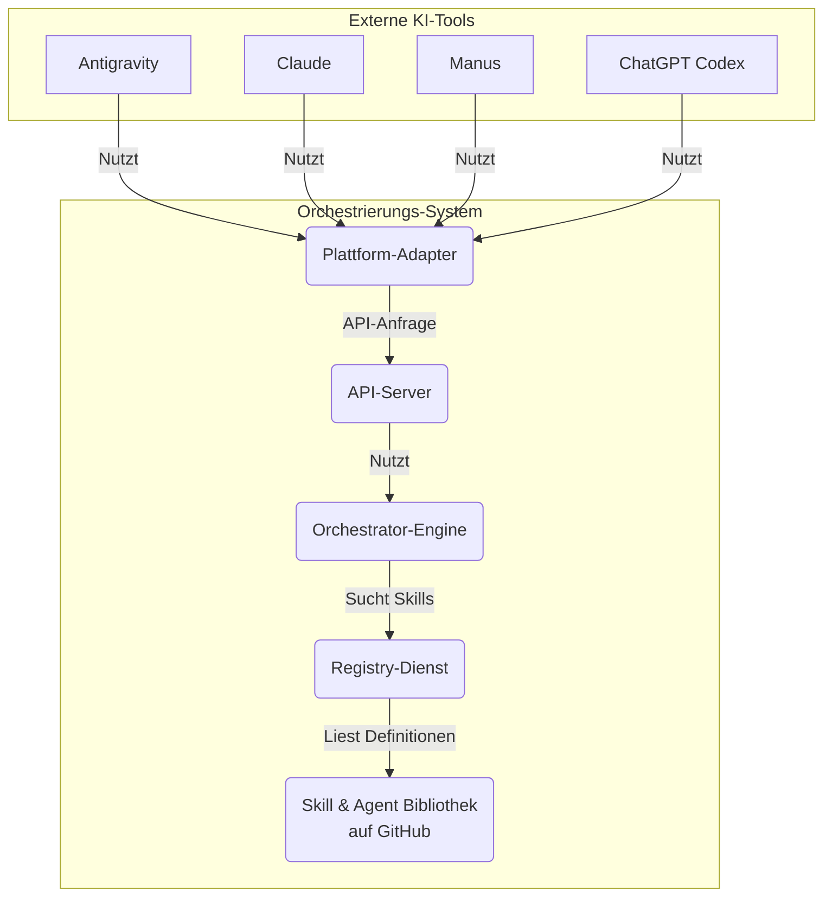

> **Hinweis**: Dieses Repository wurde automatisch von Manus, einem KI-Agenten, als Antwort auf eine Benutzeranfrage zur Erstellung eines Multi-Agent-Orchestrierungssystems generiert. Der gesamte Code, die Architektur und die Dokumentation wurden autonom erstellt.

# Skill & Agent Hub: Ein Multi-Plattform-Orchestrierungssystem

**Version**: 1.0
**Autor**: Manus AI
**Erstellt am**: 23. Januar 2026

Dieses Projekt implementiert ein **dynamisches, erweiterbares Multi-Agent-Orchestrierungssystem**. Es bietet eine zentrale Bibliothek für wiederverwendbare **Skills** (atomare Fähigkeiten) und **Agents** (komplexe, orchestrierende Einheiten), auf die von verschiedenen KI-Plattformen aus zugegriffen werden kann, darunter:

- Antigravity
- Claude (Cowork & Code)
- Manus
- ChatGPT Codex (OpenAI)

Das System ist so konzipiert, dass es sich dynamisch erweitern lässt: Neue Fähigkeiten können hinzugefügt werden, ohne dass bestehender Code geändert werden muss. Ein intelligenter **Discovery-Service** hilft dabei, die richtigen Werkzeuge für eine bestimmte Aufgabe zu finden, und eine **Orchestrator-Engine** kann diese Werkzeuge kombinieren, um komplexe Arbeitsabläufe auszuführen.

## Architektur-Überblick

Das System ist modular aufgebaut und basiert auf dem **Registry-Pattern**, ähnlich einem Plugin-System. Jede Fähigkeit registriert sich selbst mit Metadaten, was eine automatische Erkennung und dynamische Kombination ermöglicht.



### Kernkomponenten

| Komponente | Beschreibung |
| :--- | :--- |
| **Skill & Agent Bibliothek** | Ein Verzeichnis (`/skills`, `/agents`), das die Definitionen und Implementierungen aller Fähigkeiten enthält. |
| **Registry-Dienst** | Ein Python-Modul (`/registry`), das alle `manifest.json`-Dateien scannt, validiert und in einer SQLite-Datenbank für schnelle Abfragen indiziert. |
| **Discovery-Service** | Ein intelligenter Suchdienst (`/orchestrator/discovery.py`), der basierend auf natürlichsprachlichen Beschreibungen die passendsten Skills oder Agents findet. |
| **Orchestrator-Engine** | Die Kernlogik (`/orchestrator/orchestrator.py`), die Aufgaben entgegennimmt, Ausführungspläne erstellt (dynamisch oder vordefiniert) und die Skills ausführt. |
| **Plattform-Adapter** | Spezifische Schnittstellen (`/adapters`), die die Skills und Agents in die nativen Formate der Zielplattformen (z.B. OpenAI Function Calling, Claude Tools) übersetzen. |
| **API-Server** | Ein Flask-basierter Server, der alle Funktionen über eine REST-API zugänglich macht und als zentraler Endpunkt für alle Plattformen dient. |

## Features

- **Dynamische Registrierung**: Fügen Sie neue Skills oder Agents hinzu, indem Sie einfach ein Verzeichnis mit einer `manifest.json`-Datei erstellen. Die Registry erkennt sie automatisch.
- **Semantische Suche**: Finden Sie die richtigen Werkzeuge nicht nur nach Namen, sondern auch nach Fähigkeiten, Beschreibungen, Tags und Ein-/Ausgabetypen.
- **Multi-Strategie-Orchestrierung**: Agents können vordefinierte (sequenzielle, parallele, bedingte) oder dynamische Ausführungsstrategien verwenden.
- **Plattformübergreifende Kompatibilität**: Generieren Sie automatisch Tool-Definitionen, Funktionskataloge und Anleitungen für alle unterstützten Plattformen.
- **Zentraler API-Zugriff**: Steuern Sie das gesamte System über eine einheitliche REST-API.

## Verzeichnisstruktur

```
/skill-agent-hub
├── adapters/              # Plattform-Adapter für die Übersetzung der Formate
│   ├── antigravity_adapter.py
│   ├── base_adapter.py
│   ├── chatgpt_codex_adapter.py
│   ├── claude_adapter.py
│   ├── manus_adapter.py
│   └── api_server.py       # Zentraler Flask API-Server
├── agents/                # Verzeichnis für komplexe, orchestrierende Agents
│   └── research_agent/     # Beispiel-Agent
│       ├── manifest.json
│       └── main.py
├── core/                  # Kern-Schemata und Definitionen
│   └── manifest_schema.json # JSON-Schema für alle Manifeste
├── orchestrator/          # Logik für Discovery und Ausführung
│   ├── discovery.py
│   └── orchestrator.py
├── registry/              # Der Registry-Dienst
│   ├── registry.py
│   └── registry.db         # SQLite-Datenbank (wird automatisch erstellt)
├── skills/                # Verzeichnis für atomare, wiederverwendbare Skills
│   └── text_summarizer/    # Beispiel-Skill
│       ├── manifest.json
│       └── main.py
└── README.md              # Diese Datei
```

## Getting Started

### 1. Voraussetzungen

- Python 3.9+
- `pip` zur Installation von Abhängigkeiten
- `git`

### 2. Installation

```bash
# 1. Klonen Sie das Repository
git clone https://github.com/FassadenFix/FaFi.git
cd FaFi

# 2. Installieren Sie die Abhängigkeiten
# (Erstellen Sie ggf. zuerst eine virtuelle Umgebung)
pip install -r requirements.txt
```

### 3. Registry initialisieren

Beim ersten Start müssen alle vorhandenen Skills und Agents gescannt und in der Datenbank registriert werden.

```bash
python3 registry/registry.py scan
```

Dieser Befehl sollte bei jeder Hinzufügung eines neuen Skills oder Agents erneut ausgeführt werden (der API-Server tut dies automatisch beim Start).

### 4. API-Server starten

Der API-Server ist der zentrale Einstiegspunkt für alle Interaktionen.

```bash
python3 adapters/api_server.py
```

Der Server läuft standardmäßig auf `http://localhost:5000`.

## Einen neuen Skill erstellen

1.  **Verzeichnis erstellen**: Erstellen Sie ein neues Verzeichnis unter `/skills`, z.B. `/skills/send_email`.

2.  **`manifest.json` anlegen**: Erstellen Sie eine Manifest-Datei, die den Skill beschreibt. Dies ist das Herzstück der Registrierung.

    ```json
    {
      "manifest_version": "1.0",
      "type": "skill",
      "name": "send_email",
      "version": "1.0.0",
      "description": "Sendet eine E-Mail über einen SMTP-Server.",
      "author": "Ihr Name",
      "tags": ["email", "communication", "notification"],
      "capabilities": ["send_email"],
      "implementation": {
        "language": "python",
        "entrypoint": "main.py"
      },
      "interface": {
        "inputs": [
          {
            "name": "recipient",
            "type": "string",
            "description": "E-Mail-Adresse des Empfängers",
            "required": true
          },
          {
            "name": "subject",
            "type": "string",
            "description": "Betreff der E-Mail",
            "required": true
          },
          {
            "name": "body",
            "type": "string",
            "description": "Inhalt der E-Mail",
            "required": true
          }
        ],
        "outputs": [
          {
            "name": "status",
            "type": "string",
            "description": "Sendestatus (z.B. 'gesendet')"
          }
        ]
      }
    }
    ```

3.  **Implementierung erstellen**: Schreiben Sie den Python-Code in `main.py`. Die Hauptlogik sollte in einer Funktion namens `execute` liegen, die die in der `manifest.json` definierten Inputs als Argumente erhält und ein Dictionary mit den Outputs zurückgibt.

    ```python
    # /skills/send_email/main.py
    from typing import Dict, Any

    def execute(recipient: str, subject: str, body: str) -> Dict[str, Any]:
        # Hier kommt die Logik zum Senden der E-Mail
        print(f"Sende E-Mail an {recipient}...")
        
        # Simulierter Erfolg
        status = "gesendet"
        
        return {
            "status": status
        }
    ```

4.  **Registry aktualisieren**: Starten Sie den API-Server neu oder führen Sie `python3 registry/registry.py scan` aus. Der neue Skill ist nun im gesamten System verfügbar.

## Plattform-Integration

Der `api_server.py` stellt Endpunkte bereit, um die Skill-Kataloge für jede Zielplattform abzurufen.

- **`GET /api/v1/catalog/chatgpt_codex`**: Gibt einen JSON-Katalog im OpenAI Function Calling Format zurück.
- **`GET /api/v1/catalog/claude`**: Gibt einen JSON-Katalog im Anthropic Tool-Format zurück.
- **`GET /api/v1/catalog/manus`**: Gibt einen JSON-Katalog für die Manus-Plattform zurück.
- **`GET /api/v1/catalog/antigravity`**: Gibt einen JSON-Katalog im Antigravity Action-Format zurück.

Diese Kataloge können verwendet werden, um die KI-Tools mit den Fähigkeiten des Hubs zu konfigurieren.

## API-Referenz (Auszug)

- `POST /api/v1/discover`: Sucht nach Skills/Agents. Body: `{"query": "text zusammenfassen"}`
- `POST /api/v1/execute/skill/<name>`: Führt einen Skill aus. Body: `{"text": "...", "max_length": 100}`
- `POST /api/v1/execute/agent/<name>`: Führt einen Agent aus. Body: `{"topic": "KI-Trends"}`
- `POST /api/v1/execute/task`: Führt eine komplette Aufgabe dynamisch aus. Body: `{"task": "Finde die neuesten Nachrichten über KI und fasse sie zusammen"}`

---
