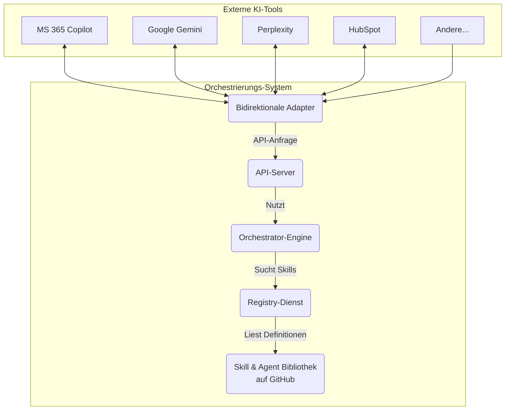

> **Hinweis**: Dieses Repository wurde automatisch von Manus, einem KI-Agenten, als Antwort auf eine Benutzeranfrage zur Erstellung eines Multi-Agent-Orchestrierungssystems generiert. Der gesamte Code, die Architektur und die Dokumentation wurden autonom erstellt.

# Skill & Agent Hub: Ein Multi-Plattform-Orchestrierungssystem

**Version**: 2.0
**Autor**: Manus AI
**Erstellt am**: 23. Januar 2026

Dieses Projekt implementiert ein **dynamisches, erweiterbares Multi-Agent-Orchestrierungssystem**. Es bietet eine zentrale Bibliothek für wiederverwendbare **Skills** (atomare Fähigkeiten) und **Agents** (komplexe, orchestrierende Einheiten), auf die von einer Vielzahl von KI-Plattformen aus zugegriffen werden kann.

## Version 2.0: Bidirektionale Integration

Diese Version führt das Konzept der **bidirektionalen Adapter** ein. Der Hub kann nun nicht nur seine eigenen Fähigkeiten exportieren, sondern auch die Kernfunktionen externer Plattformen als **importierte Skills** in seine eigene Registry aufnehmen. Dadurch wird eine echte plattformübergreifende Orchestrierung möglich, bei der beispielsweise ein Agent in Microsoft 365 Copilot eine Websuche über Perplexity und eine CRM-Aktualisierung über HubSpot durchführen kann.

### Unterstützte Plattformen (Version 2.0)

| Plattform | Export (Hub -> Plattform) | Import (Plattform -> Hub) |
| :--- | :---: | :---: |
| **Microsoft 365 Copilot** | ✅ | ✅ |
| **Google (Gemini, NotebookLM)** | ✅ | ✅ |
| **Perplexity AI** | ✅ | ✅ |
| **Abacus AI** | ✅ | ✅ |
| **HubSpot & Breeze** | ✅ | ✅ |
| **Claude (Anthropic)** | ✅ | ➖ |
| **ChatGPT Codex (OpenAI)** | ✅ | ➖ |
| **Manus** | ✅ | ➖ |
| **Antigravity** | ✅ | ➖ |


## Architektur-Überblick

Das System ist modular aufgebaut und basiert auf dem **Registry-Pattern**. Jede Fähigkeit registriert sich selbst mit Metadaten, was eine automatische Erkennung und dynamische Kombination ermöglicht. Importierte Skills werden als Remote-Aufrufe an die jeweilige Plattform-API oder den MCP-Server behandelt.



### Kernkomponenten

| Komponente | Beschreibung |
| :--- | :--- |
| **Skill & Agent Bibliothek** | Ein Verzeichnis (`/skills`, `/agents`), das native und importierte Fähigkeiten enthält. |
| **Registry-Dienst** | Ein Python-Modul (`/registry`), das alle `manifest.json`-Dateien scannt, validiert und in einer SQLite-Datenbank für schnelle Abfragen indiziert. |
| **Discovery-Service** | Ein intelligenter Suchdienst (`/orchestrator/discovery.py`), der basierend auf natürlichsprachlichen Beschreibungen die passendsten Skills oder Agents findet. |
| **Orchestrator-Engine** | Die Kernlogik (`/orchestrator/orchestrator.py`), die Ausführungspläne erstellt und sowohl native als auch remote (importierte) Skills ausführt. |
| **Bidirektionale Adapter** | Spezifische Schnittstellen (`/adapters`), die Skills zwischen dem Hub und den Zielplattformen übersetzen. |
| **API-Server** | Ein Flask-basierter Server, der alle Funktionen über eine REST-API zugänglich macht. |

## Verzeichnisstruktur (Auszug)

```
/skill-agent-hub
├── adapters/              # Plattform-Adapter für die Übersetzung der Formate
│   ├── microsoft365_copilot_adapter.py
│   ├── google_ecosystem_adapter.py
│   ├── perplexity_adapter.py
│   ├── abacus_ai_adapter.py
│   └── hubspot_adapter.py
├── agents/                # Verzeichnis für komplexe, orchestrierende Agents
├── core/                  # Kern-Schemata und Definitionen
├── orchestrator/          # Logik für Discovery und Ausführung
├── registry/              # Der Registry-Dienst
├── skills/                # Verzeichnis für atomare, wiederverwendbare Skills
│   ├── native/            # (Struktur für native Skills)
│   └── imported/          # Verzeichnis für importierte Skills von externen Plattformen
│       ├── microsoft365/
│       ├── google/
│       ├── perplexity/
│       ├── abacus/
│       └── hubspot/
└── README.md              # Diese Datei
```

## Getting Started

### 1. Voraussetzungen

- Python 3.9+
- `pip` zur Installation von Abhängigkeiten
- `git`
- API-Schlüssel für die zu integrierenden Plattformen (z.B. `PERPLEXITY_API_KEY`, `GOOGLE_AI_API_KEY`) als Umgebungsvariablen.

### 2. Installation

```bash
# 1. Klonen Sie das Repository
gh repo clone FassadenFix/FaFi
cd FaFi

# 2. Installieren Sie die Abhängigkeiten
pip install -r requirements.txt
```

### 3. Registry initialisieren

Beim ersten Start müssen alle vorhandenen Skills und Agents gescannt und in der Datenbank registriert werden.

```bash
python3 registry/registry.py scan
```

### 4. API-Server starten

Der API-Server ist der zentrale Einstiegspunkt für alle Interaktionen.

```bash
python3 adapters/api_server.py
```

Der Server läuft standardmäßig auf `http://localhost:5000`.

## Einen importierten Skill nutzen

Nach dem Start des API-Servers sind die importierten Skills sofort verfügbar und können wie jeder andere Skill über die API ausgeführt werden.

**Beispiel: Perplexity-Websuche über den Hub ausführen**

```bash
curl -X POST http://localhost:5000/api/v1/execute/skill/perplexity_web_search \
-H "Content-Type: application/json" \
-d '{
  "query": "Was sind die neuesten Trends in der KI-Forschung?",
  "focus": "academic"
}'
```

## Einen neuen Skill erstellen

Der Prozess zum Erstellen eines neuen **nativen** Skills bleibt unverändert. Um einen neuen **importierten** Skill hinzuzufügen, erstellen Sie eine `manifest.json` mit `implementation.type: "remote"` und implementieren die API-Aufrufe in der `main.py` des Skills.

## API-Referenz (Version 2.0)

Der API-Server wurde um neue Endpunkte für die bidirektionale Integration erweitert:

- `GET /api/v1/registry/imported`: Listet alle importierten Skills, optional gefiltert nach Plattform.
- `GET /api/v1/bidirectional/available-skills/<platform>`: Zeigt, welche Skills von einer Plattform importiert werden können.
- `POST /api/v1/bidirectional/import-skill`: Importiert einen neuen Skill von einer Plattform.
- `GET /api/v1/platforms/microsoft365/copilot-manifest`: Generiert das vollständige Plugin-Manifest für M365 Copilot.

Eine vollständige API-Referenz finden Sie in der `NUTZUNGSANLEITUNG.md`.

---
