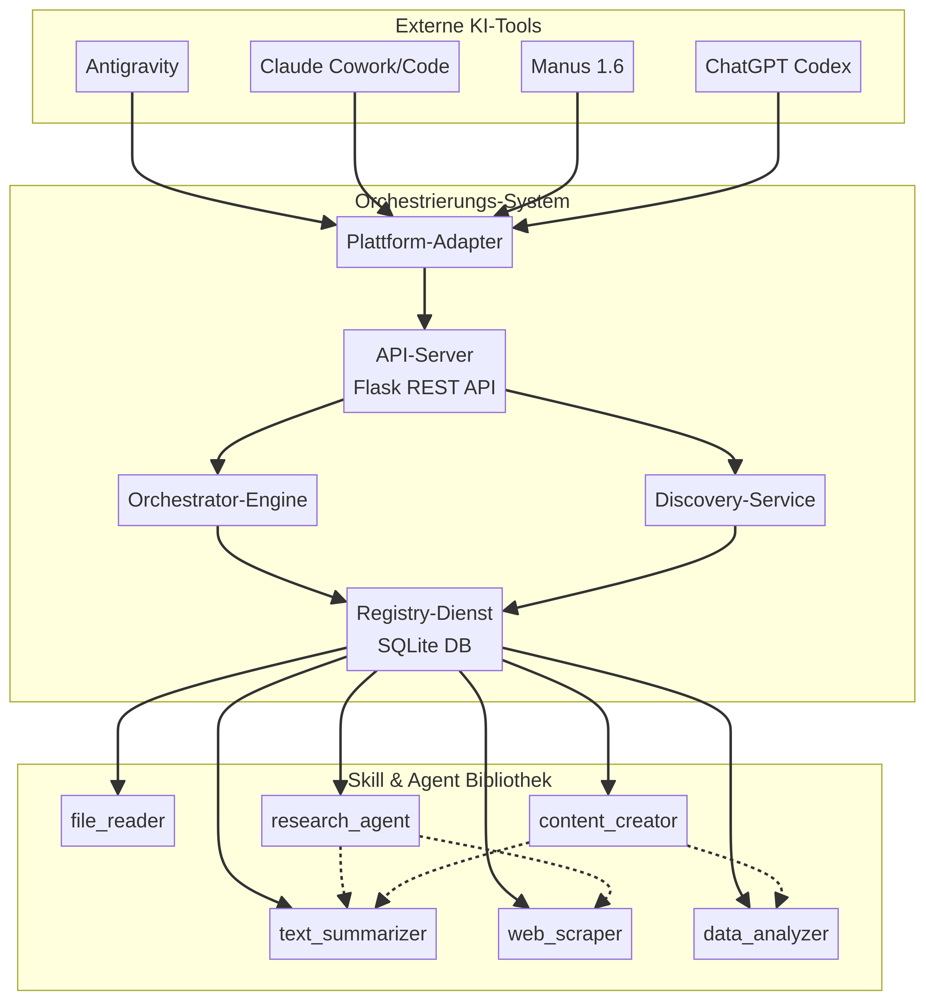

# Nutzungsanleitung: Multi-Agent-Orchestrierungssystem

**Autor:** Manus AI
**Version:** 2.0
**Datum:** 23. Januar 2026

Dieses Dokument beschreibt, wie Sie das Multi-Agent-Orchestrierungssystem in Ihre verschiedenen KI-Arbeitsumgebungen integrieren und nutzen können. Version 2.0 führt **bidirektionale Adapter** ein, die eine tiefere Integration und plattformübergreifende Orchestrierung ermöglichen.

## Systemübersicht

Das System besteht aus mehreren Kernkomponenten, die zusammenarbeiten, um eine nahtlose Integration zu ermöglichen.



### Bidirektionale Integration

Die bidirektionale Anbindung erlaubt es dem Hub, nicht nur eigene Skills bereitzustellen (**Export**), sondern auch die Fähigkeiten externer Plattformen als **importierte Skills** zu nutzen (**Import**). Dies ermöglicht komplexe, plattformübergreifende Workflows.

## Schnellstart

### 1. API-Server starten

Der API-Server ist der zentrale Zugangspunkt für alle Plattformen. Er muss auf einem Server laufen, der von Ihren KI-Tools erreichbar ist.

```bash
# Navigieren Sie zum Projektverzeichnis
cd /pfad/zu/skill-agent-hub

# Setzen Sie die notwendigen API-Schlüssel als Umgebungsvariablen
export PERPLEXITY_API_KEY="IHR_SCHLÜSSEL"
export GOOGLE_AI_API_KEY="IHR_SCHLÜSSEL"
# ... weitere Schlüssel für andere Plattformen

# Starten Sie den Server
python3 adapters/api_server.py
```

Der Server läuft standardmäßig auf `http://localhost:5000`.

### 2. Verfügbare Skills und Agents abrufen

Sobald der Server läuft, können Sie die verfügbaren Fähigkeiten abfragen.

```bash
# Liste aller Skills (native und importierte)
curl http://localhost:5000/api/v1/registry/list?type=skill

# Liste nur der importierten Skills
curl http://localhost:5000/api/v1/registry/list?type=skill&imported=true

# Katalog für eine spezifische Plattform (z.B. Microsoft 365 Copilot)
curl http://localhost:5000/api/v1/catalog/microsoft365_copilot
```

## Integration in die verschiedenen Plattformen

### Integration mit Microsoft 365 Copilot

Die Integration erfolgt über ein **Copilot Plugin**. Der Hub generiert automatisch das notwendige Manifest und die OpenAPI-Spezifikation.

1.  **Manifest abrufen:** Rufen Sie den Endpunkt `GET /api/v1/platforms/microsoft365/copilot-manifest` auf. Dieser liefert das vollständige Plugin-Manifest.
2.  **Plugin registrieren:** Verwenden Sie das Manifest, um das Plugin im Microsoft 365 Admin Center zu registrieren. Stellen Sie sicher, dass die im Manifest angegebene `api.url` auf Ihren laufenden API-Server verweist.
3.  **Nutzen:** Nach der Aktivierung können Sie die Hub-Skills direkt im Copilot-Chat verwenden (z.B. "Fasse diesen Text mit dem Skill Hub zusammen").

### Integration mit Google (Gemini, NotebookLM, AI Studio)

Die Integration mit dem Google-Ökosystem erfolgt über das **Function Calling**-Feature von Gemini.

1.  **Tool-Konfiguration abrufen:** Der Endpunkt `GET /api/v1/platforms/gemini/tools-config` liefert eine vollständige Tool-Konfiguration für die Gemini API.
2.  **API-Anfragen:** Verwenden Sie die erhaltene Konfiguration im `tools`-Parameter Ihrer API-Anfragen an die Gemini API.
3.  **Ausführung:** Wenn das Modell einen Tool-Aufruf generiert, leiten Sie die Anfrage an den entsprechenden `/api/v1/execute/skill/<name>`-Endpunkt des Hubs weiter.

### Integration mit Perplexity AI

Perplexity unterstützt ebenfalls Function Calling.

1.  **Katalog abrufen:** Nutzen Sie `GET /api/v1/catalog/perplexity`, um die Tool-Definitionen zu erhalten.
2.  **API-Anfragen:** Fügen Sie die Definitionen zum `tools`-Parameter Ihrer Anfragen an die Perplexity Chat-API hinzu.

### Integration mit HubSpot & HubSpot Breeze

Die Integration erfolgt über **Custom Code Actions** in HubSpot Workflows und über den **HubSpot MCP-Server**.

1.  **Custom Actions:** Der Endpunkt `GET /api/v1/catalog/hubspot` liefert Definitionen für Custom Code Actions. Diese können in HubSpot importiert werden, um Hub-Skills in Workflows zu nutzen.
2.  **MCP-Server:** Die importierten HubSpot-Skills (`hubspot_crm_operations`) nutzen den bereits konfigurierten `manus-mcp-cli`, um direkt mit der HubSpot-API zu interagieren.

### Integration mit Abacus AI

Die Integration erfolgt über **Custom Functions** für Chat LLMs und die Konfiguration von **Deep Agents**.

1.  **Funktionskatalog:** Der Endpunkt `GET /api/v1/catalog/abacus_ai` liefert einen Katalog, der in Abacus AI importiert werden kann.
2.  **Deep Agent Konfiguration:** Der Endpunkt `GET /api/v1/platforms/abacus/deep-agent-config` generiert eine Konfiguration, um einen Deep Agent mit dem Skill Hub als externes Tool zu verbinden.

## Einen neuen importierten Skill hinzufügen

Das Hinzufügen von Fähigkeiten externer Plattformen ist der Kern der bidirektionalen Erweiterbarkeit.

### Schritt 1: Verzeichnis erstellen

Erstellen Sie ein Verzeichnis unter `/skills/imported/<plattform_name>/<skill_name>`.

```bash
mkdir -p skills/imported/neue_plattform/neuer_skill
```

### Schritt 2: `manifest.json` anlegen

Erstellen Sie eine Manifest-Datei mit `implementation.type: "remote"`.

```json
{
  "manifest_version": "1.0",
  "type": "skill",
  "name": "neuer_remote_skill",
  "description": "Beschreibung des Remote-Skills.",
  "implementation": {
    "type": "remote",
    "language": "python",
    "entrypoint": "main.py",
    "remote_config": {
      "service": "neue_plattform_api",
      "api_key_env": "NEUE_PLATTFORM_API_KEY"
    }
  },
  "interface": { ... },
  "metadata": {
    "source_platform": "Neue Plattform",
    "imported": true
  }
}
```

### Schritt 3: Implementierung erstellen

Erstellen Sie die `main.py`-Datei, die die API-Aufrufe an die externe Plattform durchführt. Lesen Sie den API-Schlüssel aus den Umgebungsvariablen.

```python
import os
import requests

def execute(parameter: str) -> dict:
    api_key = os.environ.get("NEUE_PLATTFORM_API_KEY")
    # ... Ihre API-Logik hier ...
    return {"ergebnis": "..."}
```

### Schritt 4: Registry aktualisieren

Starten Sie den API-Server neu oder rufen Sie `POST /api/v1/registry/scan` auf. Der neue importierte Skill ist nun im gesamten System verfügbar.

## API-Referenz (Version 2.0)

| Endpunkt | Methode | Beschreibung |
| :--- | :--- | :--- |
| `/api/v1/health` | GET | Health-Check |
| `/api/v1/info` | GET | Systeminformationen (Version 2.0) |
| `/api/v1/registry/scan` | POST | Scannt und registriert alle Skills/Agents |
| `/api/v1/registry/list` | GET | Listet Entities auf (Filter: `type`, `imported`) |
| `/api/v1/registry/imported` | GET | Listet alle importierten Skills, gruppiert nach Plattform |
| `/api/v1/discover` | POST | Sucht nach Skills (Filter: `include_imported`) |
| `/api/v1/execute/skill/<name>` | POST | Führt einen nativen oder importierten Skill aus |
| `/api/v1/execute/agent/<name>` | POST | Führt einen Agent aus |
| `/api/v1/catalog/<platform>` | GET | Gibt den Katalog für eine Plattform zurück |
| `/api/v1/bidirectional/available-skills/<platform>` | GET | Zeigt importierbare Skills einer Plattform |
| `/api/v1/platforms/microsoft365/copilot-manifest` | GET | Generiert das M365 Copilot Plugin Manifest |
| `/api/v1/platforms/gemini/tools-config` | GET | Generiert die Gemini Tools-Konfiguration |
| `/api/v1/platforms/abacus/deep-agent-config` | GET | Generiert die Abacus Deep Agent Konfiguration |
